```mermaid
flowchart TB
    %% --- STYLING ---
    classDef vm fill:#f4f4f4,stroke:#333,stroke-width:2px,stroke-dasharray: 5 5;
    classDef microservice fill:#fff3e0,stroke:#f57c00,stroke-width:2px,rx:5,ry:5;
    classDef db fill:#e1f5fe,stroke:#0277bd,stroke-width:2px,shape:cylinder;
    classDef component fill:#e8f5e9,stroke:#2e7d32,stroke-width:2px;
    classDef vault fill:#212121,stroke:#000,stroke-width:2px,color:#fff;
    classDef bigdata fill:#f3e5f5,stroke:#7b1fa2,stroke-width:2px;

    %% --- TOP LEVEL: USER & GATEWAY ---
    subgraph S_FW [Firewall / Gateway VM<br/>Nginx Reverse Proxy]
        RP[Nginx Reverse Proxy<br/>TLS Termination / Routing]:::component
    end

    User(User Browser<br/>Chrome/Firefox):::component --> RP

    %% --- FRONTEND ---
    subgraph S_FRONT [Frontend VM<br/>React + Vite + Tailwind]
        FE[React Frontend<br/>JS/TS · Vite · TailwindCSS]:::microservice
    end
    RP --> FE

    %% --- BACKEND ---
    subgraph S_BACK [Backend VM - Microservices<br/>Spring Boot 3 · Java 21 · Docker]
        direction TB

        subgraph G_PAT [ ]
            style G_PAT fill:none,stroke:none
            PAT[Patient Service<br/>Spring Boot REST]:::microservice --> PAT_DB[(PostgreSQL<br/>Patient DB)]:::db
        end

        subgraph G_DOC [ ]
            style G_DOC fill:none,stroke:none
            DOC[Doctor Service<br/>Spring Boot REST]:::microservice --> DOC_DB[(PostgreSQL<br/>Doctor DB)]:::db
        end

        subgraph G_APPT [ ]
            style G_APPT fill:none,stroke:none
            APPT[Appointment Service<br/>Spring Boot REST]:::microservice --> APPT_DB[(PostgreSQL<br/>Appt DB)]:::db
        end

        subgraph G_ING [ ]
            style G_ING fill:none,stroke:none
            INGEST[Ingest Wearables<br/>Spring Boot + Kafka Producer]:::microservice --> INGEST_DB[(PostgreSQL<br/>Wearables DB)]:::db
        end

        subgraph G_ALERT [ ]
            style G_ALERT fill:none,stroke:none
            ALERT[Health Alert Engine<br/>Spring Boot + Kafka Consumer]:::microservice --> ALERT_DB[(PostgreSQL<br/>Alerts DB)]:::db
        end
    end

    RP --> PAT
    RP --> DOC
    RP --> APPT
    RP --> INGEST
    RP --> ALERT

    FE -.-> RP

    %% --- KEY VAULT ---
    subgraph S_SEC [Security & Secrets<br/>HashiCorp Vault OSS]
        KV[HashiCorp Vault<br/>Secrets · JWT · DB Credentials]:::vault
    end

    KV -.-> PAT
    KV -.-> DOC
    KV -.-> APPT
    KV -.-> INGEST
    KV -.-> ALERT

    %% --- REALTIME STREAMING ---
    subgraph S_KAFKA [Kafka VM<br/>Apache Kafka · Zookeeper]
        KAFKA[KAFKA Cluster<br/>Apache Kafka]:::component
    end

    subgraph S_SPARK_RT [Realtime Processing VM<br/>Apache Spark Streaming]
        SPARK_RT[Spark Streaming<br/>Structured Streaming]:::component
    end

    INGEST -->|1. Publish readings<br/>Kafka Producer| KAFKA
    KAFKA -->|2. Stream data<br/>Kafka Topic| SPARK_RT
    SPARK_RT -->|3. Alerts computed| KAFKA
    KAFKA -->|4. Consume alerts<br/>Kafka Consumer| ALERT
    ALERT -->|5. Notify doctor| DOC

    %% --- BIG DATA ANALYTICS PIPELINE ---
    subgraph S_ANALYTICS [Big Data & Analytics Pipeline<br/>Hadoop · Spark · MongoDB · Postgres · Power BI]
        direction LR

        subgraph SRC [Data Sources & Scraping]
            SCRAPER[ETL Scraper<br/>PySpark + Python]:::bigdata
        end

        subgraph DATA_LAKE [Data Lakehouse]
            HDFS[(Hadoop HDFS<br/>Bronze Layer)]:::db
            MONGO[(MongoDB<br/>Silver Layer)]:::db
            POSTGRES[(Postgres DWH<br/>Gold Layer)]:::db
        end

        BI[Power BI<br/>Analytics Dashboards]:::component

        SCRAPER --> HDFS
        HDFS -->|Spark ETL<br/>Clean & Transform| MONGO
        MONGO -->|Spark ETL<br/>Model-Ready| POSTGRES
        POSTGRES --> BI
    end

    %% --- SYSTEM CONNECTIONS ---
    KAFKA -.->|Mirror Topic<br/>Long-term Storage| HDFS
    ALERT_DB -.->|Export Alerts<br/>Model Training| HDFS

    DOC o--o|Analytics API<br/>Trends & Stats| POSTGRES

    class S_FW,S_FRONT,S_BACK,S_KAFKA,S_SPARK_RT,S_ANALYTICS vm

```

# 🏥 **EpiSante — Microservices Medical Platform**

_A fully containerized, production-ready microservices system inspired by Doctolib._

EpiSante is a **distributed medical platform** built using a **microservices architecture**, where **each service runs in its own Docker container**, and each service has **its own dedicated PostgreSQL database** to ensure isolation, scalability, and clean DevOps practices.

---




---

# 🚀 **Main Technologies**

- **Spring Boot 3+** (backend microservices)

- **React + Vite + Tailwind** (frontend)

- **PostgreSQL (one per service)**

- **Docker & Docker Compose**

- **Nginx Reverse Proxy** (gateway)

- **Flyway** (DB migrations)

- **Prometheus + Grafana** (monitoring)

- **Loki** (logs)

- **Mermaid diagrams** (architecture documentation)


---

# 📦 **Architecture Overview**

EpiSante adopts a **real microservices architecture**:

- Each business domain = **one microservice**

- Each microservice = **one isolated PostgreSQL database**

- Communication internal = **REST over Docker network**

- External traffic routed through **Nginx Gateway**

- Everything containerized


---

# 🧱 **Project Structure**

```css
episante/
│
├── patient-service/
│   ├── src/main/java
│   ├── src/main/resources/
│   │     ├── application.yaml
│   │     └── db/migration/
│   │            ├── V1__init.sql
│   │            └── V2__seed_patients.sql
│   └── Dockerfile
│
├── doctor-service/
├── appointment-service/
├── auth-service/
├── notification-service/
│
├── frontend/
│
├── gateway/
│   └── nginx.conf
│
├── postgres/
│   ├── patient-db/
│   ├── doctor-db/
│   ├── appointment-db/
│   ├── auth-db/
│   └── notification-db/
│
├── infra/
│   ├── docker-compose.yml
│   ├── network/
│   ├── certbot/
│   └── scripts/
│
└── monitoring/
    ├── grafana/
    ├── prometheus/
    └── loki/
```

---

# 🔗 **Container Communication (Mermaid Diagram)**

This diagram shows how each component talks to others inside Docker.


---

# 🗄️ **Database Isolation Philosophy**

Each microservice **owns its own schema and database**:

|Microservice|Database|Purpose|
|---|---|---|
|patient-service|patientdb|Patients info|
|doctor-service|doctordb|Doctors info|
|appointment-service|appointmentdb|Appointment logic|
|auth-service|authdb|Users + roles|
|notification-service|notifdb|Email/SMS queue|

This architecture provides:

- Loose coupling

- Independent scaling

- Better security

- Easier CI/CD

- Failure isolation

- True microservices practice


---

# 🐳 **Running the Project**

Go to the infra folder:
```bash
cd infra
docker compose up -d

```

This command starts:

- All microservices

- All PostgreSQL DBs

- Nginx gateway

- Monitoring stack

- Frontend


To see running containers:

```bash
docker ps
```

To see logs of a specific service:

```bash
docker logs patient-service
docker logs patient-db
```

---

# 🧪 **Database Initialization**

Every database is initialized automatically through:

```bash
postgres/<service>-db/init/*.sql
```

These scripts run _only on first DB creation_ and handle:

- Schema creation

- Seed data

- Migration versioning (compatible with Flyway)


---

# 📡 **Service Endpoints**

|Service|Port|Example|
|---|---|---|
|patient-service|9091|`/api/patients`|
|doctor-service|9092|`/api/doctors`|
|appointment-service|9093|`/api/appointments`|
|auth-service|9094|`/api/auth/login`|
|notification-service|9095|`/api/notify`|
|frontend|3000|React app|
|nginx|80/443|gateway|

---

# 📊 **Monitoring**

### After running:

```bash
http://localhost:3000  - Grafana
http://localhost:9090  - Prometheus
http://localhost:3100  - Loki
```

Dashboards:

- JVM metrics

- Spring Boot metrics

- Database metrics

- Container metrics


---

# 🛡️ **Reverse Proxy (Nginx)**

All traffic enters through the gateway:

```bash
/api/patients → patient-service
/api/doctors → doctor-service
```

This ensures:

- HTTPS termination

- Rate limiting (optional)

- Authentication (optional)

- Logging and auditability


---

# 🧩 **Next Steps**

Planned extensions:

- Add Kafka for event-driven communication

- Add Redis for caching

- Integrate Keycloak for authentication

- Add Spark or Python ML service